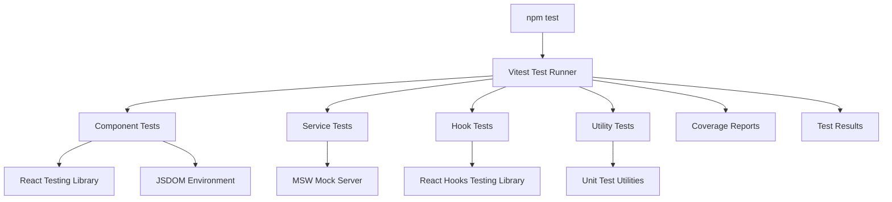

# Design Document - Frontend CI Testing Setup

## Overview

This design document outlines the testing architecture for the warehouse dashboard React application frontend. The solution implements a modern testing stack with Vitest as the primary test runner, providing automated testing capabilities accessible via `npm test` command with comprehensive coverage of React components, services, hooks, and utilities.

## Architecture

### Frontend Testing Architecture (React/Vite)



## Components and Interfaces

### Frontend Testing Components

#### 1. Test Configuration
- **Vitest Config**: Extends Vite configuration for testing environment
- **Testing Library Setup**: Configures React Testing Library with custom render utilities
- **Mock Service Worker**: Handles API mocking for isolated component testing

#### 2. Component Test Suite
- **Dashboard Component Tests**: Verify main dashboard functionality and data display
- **Form Component Tests**: Test warehouse form validation and submission
- **File Upload Tests**: Verify file upload component behavior
- **Error Boundary Tests**: Test error handling and recovery

#### 3. Service Layer Tests
- **Warehouse Service Tests**: Mock API calls and verify data transformation
- **Error Handler Tests**: Test error handling utilities and user feedback
- **HTTP Interceptor Tests**: Verify request/response processing

#### 4. Hook Tests
- **useErrorHandler Tests**: Test custom error handling hook behavior
- **Custom Hook Integration**: Verify hook state management and side effects


## Data Models

### Test Data Structures

#### Frontend Test Data
```typescript
interface TestWarehouse {
  id: number;
  warehouseType: string;
  address: string;
  city: string;
  state: string;
  zone: string;
  contactPerson: string;
  contactNumber: string;
  totalSpaceSqft: number[];
  compliances: string;
  ratePerSqft: string;
  uploadedBy: string;
  WarehouseData: TestWarehouseData;
}

interface TestWarehouseData {
  latitude?: number;
  longitude?: number;
  fireNocAvailable?: boolean;
  fireSafetyMeasures?: string;
  landType?: string;
  vaastuCompliance?: string;
  approachRoadWidth?: string;
  dimensions?: string;
  parkingDockingSpace?: string;
  pollutionZone?: string;
  powerKva?: string;
}
```

#### Backend Test Data
```javascript
// Mock API responses for frontend testing
const mockApiResponses = {
  warehouses: [
    {
      id: 1,
      warehouseType: "Industrial",
      address: "123 Test Street",
      city: "Test City",
      state: "Test State",
      zone: "North",
      contactPerson: "John Doe",
      contactNumber: "1234567890",
      totalSpaceSqft: [1000, 2000],
      compliances: "Fire Safety, Environmental",
      ratePerSqft: "50",
      uploadedBy: "test@example.com",
      WarehouseData: {
        latitude: 12.9716,
        longitude: 77.5946,
        fireNocAvailable: true
      }
    }
  ],
  errors: {
    validation: { error: "Invalid input", issues: [] },
    notFound: { error: "Warehouse not found" },
    serverError: { error: "Internal server error" }
  }
};
```

## Error Handling

### Frontend Error Testing
- **Network Error Simulation**: Test offline scenarios and connection failures using MSW
- **API Error Response Testing**: Verify handling of 400, 404, 500 status codes from backend
- **Validation Error Display**: Test form validation error messages and user feedback
- **Error Boundary Testing**: Verify component error recovery and fallback UI
- **Service Layer Error Testing**: Test error handling in warehouseService methods

## Testing Strategy

### Unit Testing Strategy
- **Component Isolation**: Test components in isolation with mocked dependencies
- **Function Testing**: Test utility functions with various input scenarios
- **Hook Testing**: Test custom hooks with different state scenarios
- **Service Testing**: Test API service methods with mocked HTTP responses

### Integration Testing Strategy
- **Component Integration**: Test component interactions and data flow between parent/child components
- **Service Integration**: Test complete API service workflows with mocked backend responses
- **Error Flow Integration**: Test error propagation from services through components to UI
- **File Upload Integration**: Test complete file upload workflow from component to service layer
- **Router Integration**: Test navigation and route-based component rendering

### Test Coverage Strategy
- **Minimum Coverage**: 80% code coverage for frontend codebase
- **Critical Path Coverage**: 100% coverage for core business logic (warehouse CRUD operations)
- **Component Coverage**: Comprehensive testing of all React components
- **Service Coverage**: Complete testing of API service methods and error handling
- **Hook Coverage**: Testing of custom hooks and their state management
- **Utility Coverage**: Testing of utility functions and helper methods

### Test Execution Strategy
- **Development Mode**: Vitest watch mode for rapid feedback during development
- **CI/CD Integration**: Automated test execution on code changes using GitHub Actions or similar
- **Parallel Execution**: Run tests in parallel for faster feedback
- **Test Reporting**: Generate detailed HTML coverage reports and test results

## Performance Considerations

### Test Performance
- **Fast Test Execution**: Optimize Vitest configuration for speed with parallel execution
- **Mock Optimization**: Use efficient MSW mocking strategies to reduce test time
- **Component Rendering Optimization**: Use shallow rendering where appropriate
- **Test Setup Optimization**: Minimize test setup and teardown overhead

### CI/CD Performance
- **Dependency Caching**: Cache node_modules and Vite build artifacts
- **Incremental Testing**: Run only tests affected by code changes when possible
- **Resource Optimization**: Optimize CI resource usage for cost efficiency
- **Feedback Speed**: Provide rapid feedback to developers through fast test execution

## Security Considerations

### Test Security
- **Mock Data Security**: Ensure test data doesn't contain real sensitive information
- **API Key Management**: Use test-specific API keys and environment variables
- **Mock Security**: Ensure MSW mocks don't expose sensitive backend information
- **Test Environment Isolation**: Keep test environment completely separate from production

### CI/CD Security
- **Environment Variable Security**: Secure handling of test environment variables in CI
- **Access Control**: Restrict access to test results and coverage reports
- **Audit Trail**: Maintain logs of test executions and results
- **Dependency Security**: Regular security audits of test dependencies